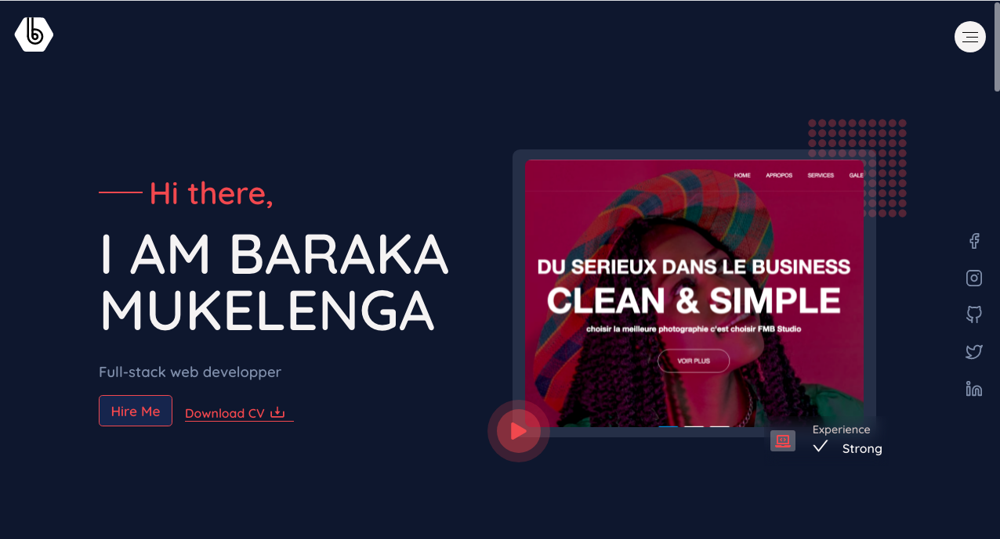

# Portfolio

> This is my portfolio, you can find in here all my best recent works. The website was designed in ReactJS.

This website was designed with the tools below:

## Built With

- React
- SASS

## Live Demo

[Visit the website](https://barackm.me/)

## Getting Started

**If you want to know more about how this website was designed, You can run the folowing commands in your terminal if you have git and nodejs already install on your computer**

`git clone https://github.com/barackm/personal-portfolio`

## Available Scripts

## `npm install`

Installs all the dependencies

### `npm start`

Runs the app in the development mode. 
Open [http://localhost:3000](http://localhost:3000) to view it in the browser.

The page will reload if you make edits. 
You will also see any lint errors in the console.

### `npm test`

Launches the test runner in the interactive watch mode. 
See the section about [running tests](https://facebook.github.io/create-react-app/docs/running-tests) for more information.

### `npm run build`

Builds the app for production to the `build` folder. 
It correctly bundles React in production mode and optimizes the build for the best performance.

The build is minified and the filenames include the hashes. 
Your app is ready to be deployed!

See the section about [deployment](https://facebook.github.io/create-react-app/docs/deployment) for more information.

## Linters

To track css linter errors you can run the following command at the root of your project if you have NPM installed on your computer.

`npx stylelint "**/*.{css,scss}"`

## Author

👤 **Barack Mukelenga**

- GitHub: [@barackm](https://github.com/barackm)
- Twitter: [@BarackMukelenga](https://twitter.com/BarackMukelenga)
- LinkedIn: [Baraka Mukelenga](https://www.linkedin.com/in/baraka-mukelenga/)

## 🤝 Contributing

Contributions, issues, and feature requests are welcome!

Feel free to check the [issues page](https://github.com/barackm/personal-portfolio/issues).

## Show your support

Give a ⭐️ if you like this project!❤️❤️❤️

## Acknowledgments

- Design and inspiration by [ibrahim shamss](https://www.behance.net/Ibrahim_Shamss)
